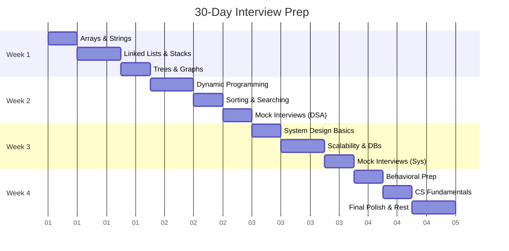

# 30-Day Interview Preparation Plan

This aggressive 4-week plan is designed for engineers who have upcoming interviews and need a quick refresher. It assumes you already have a foundational understanding of computer science concepts.

## Overview Gantt Chart

## Week-by-Week Breakdown

### Week 1: Core Data Structures
- **Day 1-2**: Arrays, Strings, Hash Tables. Focus on Two Pointers, Sliding Window.
- **Day 3-4**: Linked Lists, Stacks, Queues. Focus on Fast/Slow pointers, Monotonic stack.
- **Day 5-7**: Trees (Traversals, BSTs) and Graphs (BFS/DFS basics).

### Week 2: Advanced Algorithms
- **Day 8-10**: Recursion, Backtracking, Basic Dynamic Programming (1D, Knapsack).
- **Day 11-12**: Sorting (Merge, Quick), Searching (Binary Search), Heaps/Priority Queues.
- **Day 13-14**: Do 2-3 timed mock interviews focusing purely on LeetCode Mediums.

### Week 3: System Design
- **Day 15-16**: Core concepts: Load Balancing, Caching, Proxies, CAP Theorem.
- **Day 17-19**: Databases (SQL vs NoSQL), Sharding, Replication, Microservices.
- **Day 20-21**: Practice 3 classic design problems (e.g., URL Shortener, Chat App, Rate Limiter).

### Week 4: Behavioral & Fundamentals
- **Day 22-23**: Prepare stories using the STAR method (Situation, Task, Action, Result).
- **Day 24-25**: Review OS (Threads, Locks), Networking (TCP/IP, HTTP), DBMS (ACID, Indexes).
- **Day 26-28**: Final mock interviews, review weaknesses, and **rest**.

## Daily Checklist
- [ ] 2 LeetCode Mediums (Timeboxed to 25 mins each)
- [ ] 1 System Design Concept or Problem (45 mins)
- [ ] Read 1 Tech Blog or Architecture Article (15 mins)
