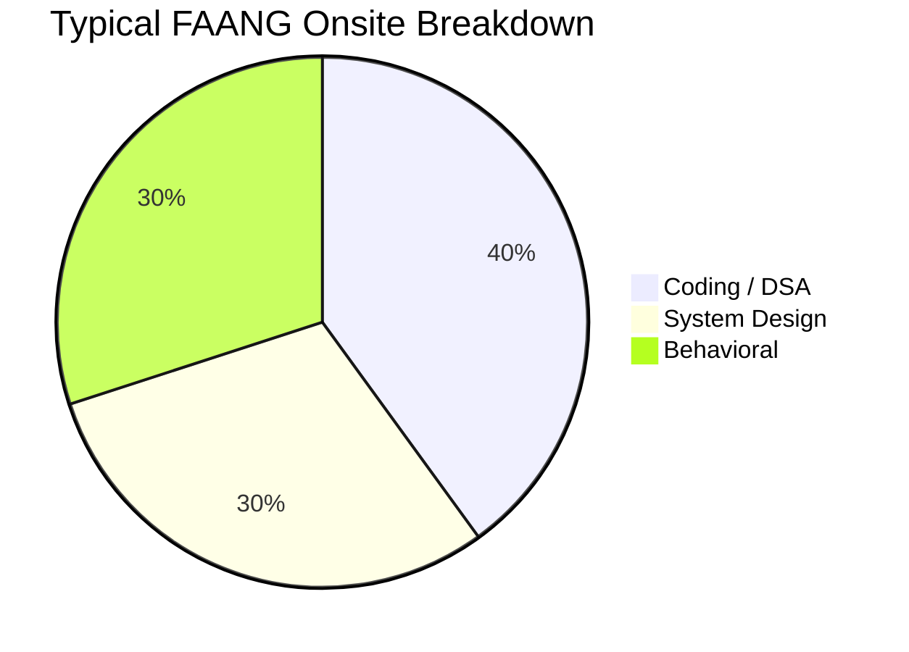

# FAANG / Big Tech Roadmap

Interviewing at top-tier tech companies requires rigorous preparation. The bar for Data Structures, Algorithms, and System Design is extremely high, and culture fit (e.g., Amazon's Leadership Principles) is heavily weighted.

## The Interview Loop

## Preparation Strategy

### 1. Data Structures & Algorithms (The Filter)
- **Difficulty**: LeetCode Medium to Hard.
- **Focus**: Dynamic Programming, Graphs, Tries, Advanced Trees.
- **Execution**: You must write bug-free code quickly. Edge cases must be identified *before* you start coding.
- **Action**: Grind the "Top Interview Questions" and company-specific tags on LeetCode.

### 2. System Design (The Leveler)
For L4 (Mid) and above, System Design often determines your level and compensation.
- **Focus**: Scalability, Trade-offs, Data Partitioning, Fault Tolerance.
- **Action**: 
  - Read *Designing Data-Intensive Applications*.
  - Practice driving the conversation. You should be proposing the architecture, not waiting for hints.

### 3. Behavioral (The Dealbreaker)
Companies like Amazon, Meta, and Google will reject technically strong candidates if they fail the behavioral rounds.
- **Action**: Create a matrix mapping your experiences to the company's core values.
- **Framework**: Use STAR (Situation, Task, Action, Result) but add an 'L' for Learnings.

## 8-Week Intense Checklist
- [ ] Complete 150-200 high-quality LeetCode problems.
- [ ] Do 5+ mock coding interviews on platforms like Pramp or Interviewing.io.
- [ ] Do 3+ mock system design interviews.
- [ ] Prepare 10 versatile behavioral stories mapped to company principles.
