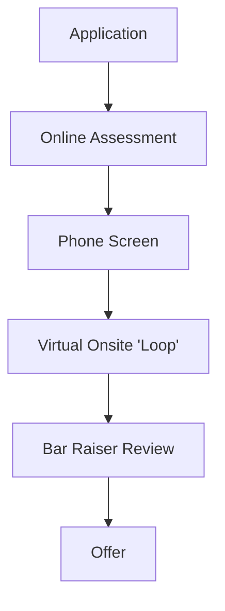

# Amazon Engineering Interview Guide

## Company Overview
Amazon is a multinational technology company focusing on e-commerce, cloud computing, online advertising, digital streaming, and artificial intelligence.

## Hiring Philosophy
Amazon's hiring is completely driven by its 16 Leadership Principles (LPs). They look for candidates who can provide concrete examples of demonstrating these principles in their past work. "Customer Obsession" and "Deliver Results" are heavily emphasized.

## Interview Pipeline

## Behavioral Expectations
Behavioral questions take up a significant portion of *every* interview round, not just a dedicated round. You must use the STAR method and explicitly tie your stories to specific Leadership Principles. Have 2-3 stories for each LP.

## Technical Expectations
DSA questions are generally easier than Google/Meta, leaning towards LeetCode Easy-Medium. The focus is on clean code, correct object-oriented principles, and logical problem-solving rather than obscure algorithms.

## System Design Expectations
Amazon focuses heavily on System Design for SDE II and above, particularly related to AWS services conceptually (even if you don't name them, they expect scalable cloud architecture). Designing distributed, highly available services is key. 

## Preparation Roadmap
1. **Week 1-2:** Prepare 15+ behavioral stories mapping to all 16 LPs.
2. **Week 3-4:** Practice basic to medium LeetCode questions, focusing on string manipulation, trees, and object-oriented design.
3. **Week 5-6:** Practice System Design (e.g., designing Amazon shopping cart, locker service).

## Interview Scorecard
- **Coding:** Correctness, complexity.
- **Design:** Scalability, architecture.
- **Leadership Principles:** The most critical component.
- **Bar Raiser:** Ensures the candidate is better than 50% of the current employees in that role.

## Common Mistakes
- Neglecting Leadership Principles preparation.
- Using "we" instead of "I" in behavioral stories.
- Falsifying or exaggerating impact (interviewers will dig deep).

## Resources
- [Amazon Leadership Principles](https://www.amazon.jobs/content/en/our-workplace/leadership-principles)
- Grokking the System Design Interview
