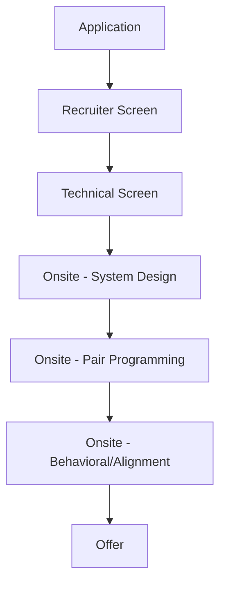

# Anthropic Engineering Interview Guide

## Company Overview
Anthropic is an AI safety and research company that builds reliable, interpretable, and steerable AI systems (like Claude).

## Hiring Philosophy
Anthropic strongly emphasizes AI safety, constitutional AI, and rigorous, careful engineering. They look for thoughtful engineers who prioritize robustness and security over moving recklessly fast.

## Interview Pipeline

## Behavioral Expectations
High focus on AI alignment, ethics, and safety. You must demonstrate a thoughtful approach to engineering, a willingness to engage in intellectual debates, and a low ego.

## Technical Expectations
They favor practical, applied engineering skills over competitive programming puzzles. Expect pair programming sessions where you work through complex, real-world problems. Strong emphasis on code correctness, testing, and debugging.

## System Design Expectations
Focuses on reliable, secure, and scalable infrastructure. You may be asked to design systems for securely handling massive datasets, training pipelines, or highly available inference endpoints with strict rate limiting and safety guardrails.

## Preparation Roadmap
1. **Week 1-2:** Read Anthropic's research on Constitutional AI and AI safety.
2. **Week 3-4:** Practice pair programming and explaining your code out loud.
3. **Week 5-6:** Study secure system design and data-intensive applications.

## Interview Scorecard
- **Careful Engineering:** Prioritizing correctness, security, and tests.
- **Safety Alignment:** Understanding and aligning with the mission.
- **Technical Competence:** Practical coding and systems architecture.

## Common Mistakes
- Approaching problems with a "move fast and break things" mindset.
- Failing to write tests or consider edge cases during coding rounds.
- Lacking knowledge of basic AI safety concepts.

## Resources
- Anthropic Research Blog
- [Constitutional AI Paper](https://www.anthropic.com/index/constitutional-ai-harmlessness-from-ai-feedback)
