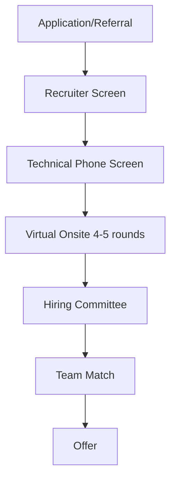

# Google Engineering Interview Guide

> [!WARNING]
> **Community Verification Required:** Company hiring pipelines change rapidly. This guide was last updated **July 2026**. If you have recently interviewed at Google, please [submit a PR](https://github.com/Ashid332/interview-preparation/pulls) to verify or update this pipeline.
## Company Overview
Google is a multinational technology company that specializes in Internet-related services and products, which include online advertising technologies, a search engine, cloud computing, software, and hardware.

## Hiring Philosophy
Google focuses on hiring "smart creatives." They value general cognitive ability, leadership, role-related knowledge, and "Googleyness" (comfort with ambiguity, bias to action, collaborative nature).

## Interview Pipeline

## Behavioral Expectations
Google looks for "Googleyness":
- Doing the right thing
- Striving for excellence
- Keeping an eye on the goals
- Being proactive and collaborative

## Technical Expectations
Google is famous for its rigorous Data Structures and Algorithms interviews. Expect LeetCode Medium to Hard questions. High standards for clean, bug-free, and optimal code without relying on an IDE.

## System Design Expectations
Expected for L5 (Senior) and above. You need to demonstrate the ability to design highly scalable, available, and performant distributed systems. Often involves drawing block diagrams and discussing trade-offs (e.g., consistency vs availability).

## Preparation Roadmap
1. **Month 1:** Focus on core DSA (Graphs, Trees, DP) and LeetCode Mediums.
2. **Month 2:** Mix of LeetCode Hards and System Design fundamentals.
3. **Month 3:** Mock interviews, behavioral prep (STAR method), and refining system design.

## Interview Scorecard
- **General Cognitive Ability:** Problem-solving skills and learning ability.
- **Role-Related Knowledge:** Technical skills and experience.
- **Leadership:** Emergent leadership and taking initiative.
- **Googleyness:** Cultural add.

## Common Mistakes
- Jumping to write code before fully understanding the problem.
- Failing to communicate thought processes.
- Ignoring edge cases.
- In System Design, failing to drive the conversation.

## Resources
- [Tech Interview Handbook](https://techinterviewhandbook.org)
- [System Design Primer](https://github.com/donnemartin/system-design-primer)
- LeetCode Top Google Questions
