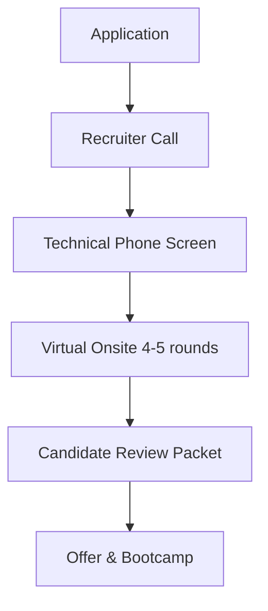

# Meta (Facebook) Engineering Interview Guide

## Company Overview
Meta builds technologies that help people connect, find communities, and grow businesses. Products include Facebook, Instagram, WhatsApp, and Reality Labs.

## Hiring Philosophy
Meta values "Move Fast" and "Focus on Impact". They want engineers who can write code quickly and bug-free, and who are highly self-directed and capable of navigating a bottom-up engineering culture.

## Interview Pipeline

## Behavioral Expectations
The "Jedi" or behavioral round focuses on past conflict resolution, giving/receiving feedback, and managing difficult projects. They want to see empathy, ownership, and an ability to thrive in a fast-paced environment.

## Technical Expectations
Meta's coding rounds are notoriously fast-paced. You are typically expected to solve two LeetCode Medium/Hard questions optimally in 45 minutes. Speed, accuracy, and writing completely bug-free code are essential. They frequently recycle questions from their top LeetCode list.

## System Design Expectations
System design rounds (Pirate interviews) focus on designing large-scale consumer products (e.g., News Feed, Instagram, Messenger). Focus heavily on API design, data schema, and scaling out massive read/write volumes.

## Preparation Roadmap
1. **Month 1-2:** Grind the top 100 Meta LeetCode questions. Focus heavily on speed (aim for 15-20 mins per question).
2. **Month 2:** System Design practice. Read about Meta's architecture (TAO, Haystack).
3. **Month 3:** Behavioral interview prep and rapid mock coding sessions.

## Interview Scorecard
- **Coding:** Speed, optimal solution, bug-free execution.
- **Architecture:** Scalability, clear abstractions, trade-off analysis.
- **Behavioral:** Self-awareness, conflict resolution, impact.

## Common Mistakes
- Being too slow in the coding round.
- Getting defensive during the behavioral interview.
- Over-engineering in system design without justifying trade-offs.

## Resources
- LeetCode Meta Tag
- Meta Engineering Blog
- [HelloInterview Meta Guide](https://www.hellointerview.com/)
