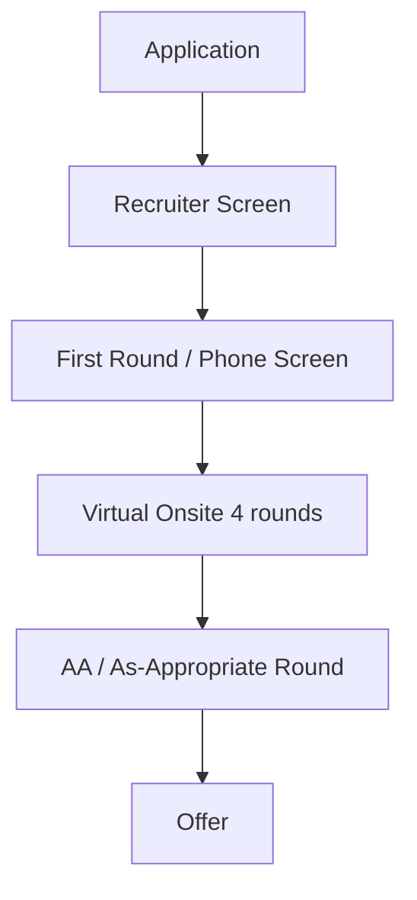

# Microsoft Engineering Interview Guide

## Company Overview
Microsoft is a multinational technology corporation which produces computer software, consumer electronics, personal computers, and related services, best known for the Windows line of operating systems, the Microsoft Office suite, and the Internet Explorer and Edge web browsers.

## Hiring Philosophy
Microsoft values a growth mindset, inclusivity, and technical competence. They focus heavily on how well candidates collaborate, their passion for technology, and their ability to solve complex, real-world problems.

## Interview Pipeline

## Behavioral Expectations
Microsoft is very focused on behavioral questions and past experiences. They want to see a history of learning from mistakes, cross-team collaboration, and customer empathy.

## Technical Expectations
Microsoft interviews range from LeetCode Easy to Medium. They often test fundamental CS concepts, string manipulation, linked lists, and trees. Depending on the team, they might also test domain-specific knowledge (e.g., C# for Windows teams, OS concepts, or Cloud for Azure).

## System Design Expectations
Expected for Senior (Level 63+) and Principal roles. Focus is often on enterprise-scale design, Azure cloud patterns, and microservices architecture. Focus heavily on robustness, security, and scalability.

## Preparation Roadmap
1. **Month 1:** Polish resume, review past projects, practice LeetCode Mediums.
2. **Month 2:** Focus on core data structures, algorithms, and domain-specific skills (if applying for a specific stack).
3. **Month 3:** System design prep and mock interviews emphasizing clear communication.

## Interview Scorecard
- **Technical Competency:** Coding, algorithms, system design.
- **Collaboration:** Teamwork and communication.
- **Drive for Results:** Impact and execution.
- **Customer Focus:** Empathy for the end user.

## Common Mistakes
- Not asking clarifying questions; Microsoft interviewers often give intentionally vague prompts.
- Poor naming conventions and messy code.
- Failing to test the code with multiple examples before declaring it finished.

## Resources
- Microsoft Careers Page
- Cracking the Coding Interview
