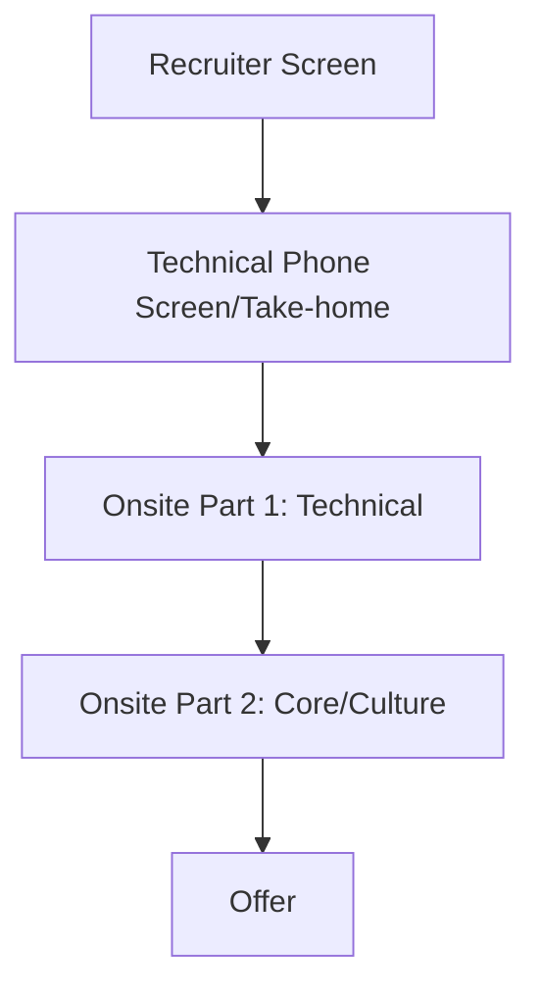

# Netflix Engineering Interview Guide

## Company Overview
Netflix is a leading streaming entertainment service with over 200 million paid memberships in over 190 countries enjoying TV series, documentaries, and feature films across a wide variety of genres and languages.

## Hiring Philosophy
Netflix exclusively hires experienced, Senior engineers (they rarely hire new grads). They rely heavily on their famous culture deck: "Freedom and Responsibility." They seek mature, self-sufficient engineers who can handle immense autonomy.

## Interview Pipeline

## Behavioral Expectations
Behavioral questions are intense and deeply tied to their Culture Memo. You must demonstrate a history of taking calculated risks, candid communication, and making decisions based on what's best for the company, not office politics.

## Technical Expectations
Netflix interviews are highly practical and domain-specific. Instead of LeetCode puzzles, expect questions closely mirroring daily engineering work: debugging, refactoring, API design, concurrency, and deep dives into the languages/frameworks you claim to know.

## System Design Expectations
Deep expertise is expected. You need to be able to design high-throughput, low-latency systems. Netflix pioneered microservices, so a strong understanding of microservice architecture, chaos engineering, and cloud infrastructure (AWS) is crucial.

## Preparation Roadmap
1. **Month 1:** Read and deeply internalize the Netflix Culture Memo. Prepare stories aligning with each core value.
2. **Month 2:** Brush up on advanced domain-specific knowledge (e.g., deep JVM knowledge for Java devs, V8 engine for Node devs).
3. **Month 3:** Practice practical system design and architecture reviews.

## Interview Scorecard
- **Domain Expertise:** Deep knowledge of your tech stack.
- **System Design:** Pragmatic, scalable architecture.
- **Culture:** Alignment with Freedom & Responsibility, stunning colleagues, and candor.

## Common Mistakes
- Giving "standard corporate" answers to behavioral questions instead of candid, Netflix-aligned answers.
- Relying on basic LeetCode prep instead of deep domain knowledge.
- Failing to show strong ownership of past projects.

## Resources
- [Netflix Culture Memo](https://jobs.netflix.com/culture)
- Netflix TechBlog
