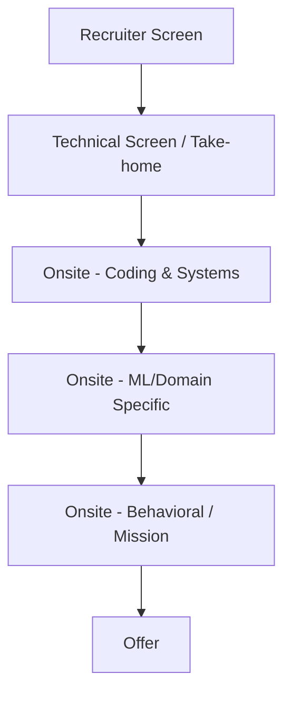

# OpenAI Engineering Interview Guide

## Company Overview
OpenAI is an AI research and deployment company dedicated to ensuring that artificial general intelligence benefits all of humanity.

## Hiring Philosophy
OpenAI looks for exceptional talent capable of operating at the frontier of technology. They value intense focus, intellectual rigor, a deep understanding of computer science fundamentals, and mission alignment.

## Interview Pipeline

## Behavioral Expectations
High emphasis on mission alignment (benefiting humanity, AI safety). They expect candidates to be highly autonomous, capable of handling rapid change, and possessing strong opinions loosely held.

## Technical Expectations
Expect very rigorous technical interviews. For software engineers, focus heavily on low-level performance, distributed systems, and complex algorithms. For ML engineers, expect deep dives into transformer architectures, CUDA optimization, and training pipelines.

## System Design Expectations
Extremely high bar for system design, often focused on how to scale massive compute workloads, manage huge datasets for training, or design ultra-low-latency inference infrastructure.

## Preparation Roadmap
1. **Month 1:** Deep dive into distributed systems and performance optimization.
2. **Month 2:** Review ML fundamentals (even for SWEs, basic context is helpful) and practice advanced coding problems.
3. **Month 3:** Prepare for deep, open-ended technical discussions and read OpenAI's published papers.

## Interview Scorecard
- **Technical Excellence:** Top-tier coding and architecture skills.
- **Mission Alignment:** Dedication to safe AGI.
- **Adaptability:** Thriving in a chaotic, fast-moving environment.

## Common Mistakes
- Faking ML knowledge (if you are a SWE, be honest about your scope).
- Underestimating the rigorousness of the infrastructure and systems rounds.
- Lacking a clear answer on why you want to work on AI specifically.

## Resources
- OpenAI Research Papers
- Designing Data-Intensive Applications
