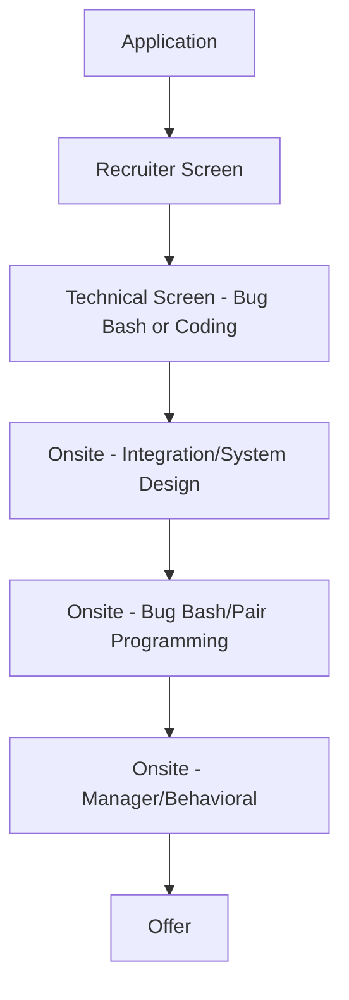

# Stripe Engineering Interview Guide

## Company Overview
Stripe is a financial infrastructure platform for the internet. Millions of companies use Stripe's software and APIs to accept payments, send payouts, and manage their businesses online.

## Hiring Philosophy
Stripe values pragmatism, rigorous thinking, and a user-first mindset. Their interviews are designed to simulate the actual day-to-day work environment as closely as possible.

## Interview Pipeline

## Behavioral Expectations
Stripe looks for engineers who care about API design, developer experience, and product impact. They want individuals who are empathetic and work well collaboratively, as their onsite often involves pair programming.

## Technical Expectations
Stripe avoids LeetCode-style puzzles. Instead, expect:
- **Integration:** Using an external API to solve a problem.
- **Bug Bash:** Finding and fixing bugs in a large, unfamiliar codebase.
- **Pair Programming:** Working directly with an interviewer to build a small feature.
You can usually use your own IDE and Google during the interview.

## System Design Expectations
Focuses on API design, idempotency, data consistency, and designing robust systems that cannot afford to lose data (given their financial domain). Strong emphasis on database design and transaction management.

## Preparation Roadmap
1. **Week 1-2:** Practice reading and debugging open-source codebases.
2. **Week 3-4:** Practice building small integrations using third-party APIs (e.g., GitHub API, Twitter API).
3. **Week 5-6:** Study API design principles, idempotency keys, and database ACID properties.

## Interview Scorecard
- **Code Quality:** Pragmatic, readable, and maintainable code.
- **Product Thinking:** Empathy for the user of the software.
- **Debugging:** Ability to quickly navigate and understand foreign code.
- **Collaboration:** How well you pair program.

## Common Mistakes
- Studying LeetCode instead of practicing practical coding and debugging.
- Ignoring edge cases related to network failures or concurrent requests in system design.
- Being a poor communicator during the pair programming rounds.

## Resources
- Stripe API Documentation (for studying good API design)
- Stripe Engineering Blog
