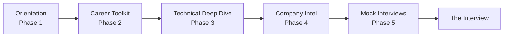

  
  <h1>Engineering Interview Handbook</h1>
  
The definitive, open-source curriculum for engineering interview preparation.

  
  
  
  

 

## 📖 Mission

The Engineering Interview Handbook is a community-driven repository designed to deconstruct the technical interview process. It provides structured learning paths, deep technical documentation, and hiring manager insights for software engineers, data scientists, and AI professionals. 

This is not a collection of leaked interview questions. It is a comprehensive curriculum that teaches the underlying engineering principles evaluated during top-tier technical interviews.

## 🚀 Quick Start: Choose Your Path

Where are you in your career journey?

*   **"I am a new graduate or junior engineer."** → Start with the [Fresh Graduate Roadmap](03-interview-calendar/fresh-graduate.md).
*   **"I am transitioning to Full Stack Engineering."** → Follow the [Full Stack Learning Path](02-learning-paths/full-stack-engineer.md).
*   **"I am preparing for Google/Amazon/Meta."** → Review the [Company Intelligence Guides](24-company-guides/README.md).
*   **"My interview is tomorrow."** → Jump directly to the [Last-Minute Prep Guides](31-last-minute-prep/README.md) and [Cheat Sheets](30-cheat-sheets/README.md).
*   **"I need to build a study schedule."** → Select a [30, 60, or 90-Day Plan](03-interview-calendar/README.md).

## 🗺️ Learning Roadmap

We recommend following the standard interview lifecycle:

## 🏗️ Repository Architecture

The handbook is divided into modular sections. Use the [Master Index](INDEX.md) for a complete alphabetical directory.

| Domain | Contents | Target Outcome |
|---|---|---|
| **[02-Learning Paths](02-learning-paths/README.md)** | 11 Role-specific curriculums (SWE, AI, Data). | Structured, week-by-week study goals. |
| **[05-Career Toolkit](05-career-toolkit/README.md)** | Resume optimization, OSS contributions, Networking. | Pass the initial recruiter screen. |
| **[06-Behavioral](06-behavioral-interviews/README.md)** | The STAR method, 10 deep-dive HR questions. | Pass the behavioral loop with "Strong Hire". |
| **[07..23-Technical](07-software-engineering/README.md)** | 100+ pages of deep technical documentation. | Pass the technical phone screen and onsite. |
| **[24-Company Guides](24-company-guides/README.md)** | Hiring philosophies of 8 major tech companies. | Tailor your approach to specific corporate values. |
| **[28-AI Coach](28-ai-interview-coach/README.md)** | Prompts for ChatGPT/Claude/Gemini. | Simulate realistic interview pressure. |
| **[29-Case Studies](29-project-case-studies/README.md)** | 9 standard side-projects analyzed for System Design. | Learn to discuss your projects architecturally. |

## 🧠 Repository Philosophy

Every technical page in this handbook is written from the perspective of a **Senior Engineering Manager**. We do not simply list definitions (e.g., "What is REST?"). Instead, we focus on:
1.  **Why interviewers ask the question.**
2.  **What a "Weak Hire" vs "Strong Hire" answer looks like.**
3.  **Real-world architectural trade-offs.**

## 🤝 Community & Contributions

This handbook relies on the engineering community to stay accurate. 

*   **Contribute:** Read our [Style Guide](STYLE_GUIDE.md) and [Contributing Guide](CONTRIBUTING.md).
*   **Share Experience:** Submit a recent interview loop via our [Interview Experience Template](.github/ISSUE_TEMPLATE/interview-experience.yml).
*   **Discussions:** Join our [GitHub Discussions](https://github.com/Ashid332/interview-preparation) to find mock interview partners.

## 🔮 Future Vision

Review our [Roadmap](ROADMAP.md) to see how we plan to evolve this repository into an interactive, AI-driven learning platform over the next 24 months.

## ❓ FAQ

**Q: Are these actual questions asked at Google/Meta?**
A: No. We do not support leaking confidential interview questions. We teach the underlying patterns (e.g., Graph traversals, Load Balancing) that these companies test for.

**Q: How often is this updated?**
A: Rapidly changing sections (like salary bands and specific company processes) are tagged with "Last Updated" badges and rely on community PRs for accuracy.

---
*Maintained with ❤️ by the open-source engineering community.*
